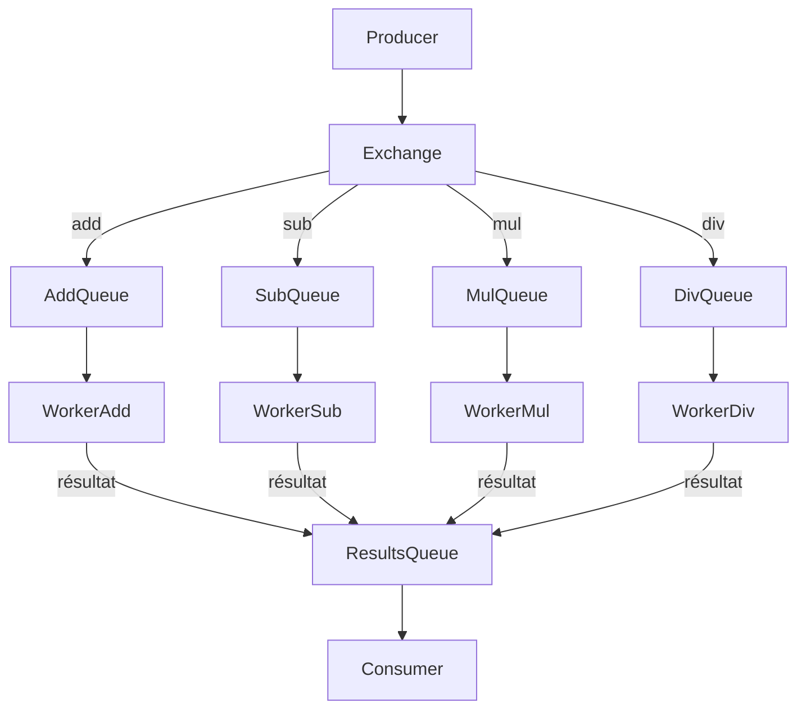

# 📦 Projet Nuclear-Physics (projet1 branch)

Ce projet met en place une architecture de calcul distribué basée sur **RabbitMQ** et **Node.js**. Il comprend :

- Un **producer** qui génère des calculs (`add`, `sub`, `mul`, `div`) de manière aléatoire.
- 4 **workers spécialisés** traitant chacun une opération.
- Un **consumer** qui récupère les résultats.
- Un fichier `docker-compose.yml` pour lancer toute l’architecture.

---

## 📐 Architecture



---

## ⚙️ Technologies

- 🐇 RabbitMQ avec interface de gestion
- 🟩 Node.js pour tous les services
- 📦 Docker & Docker Compose

---

## 🚀 Démarrage rapide

### 1. Cloner le dépôt

```bash
git clone https://github.com/enstso/Nuclear-physics.git
cd Nuclear-physics
git checkout projet1
```

### 2. Créer un fichier `.env` à partir de `.env.example` :


```env
RABBITMQ_URL=amqp://rabbitmq
RABBITMQ_HOST=rabbitmq
RABBITMQ_PORT=5672
RABBITMQ_USER=user
RABBITMQ_PASS=password
NODE_ENV=development
```

### 3. Lancer les services

```bash
docker-compose up --build
```

RabbitMQ UI disponible sur [http://localhost:15672](http://localhost:15672)  
Identifiants : `user` / `password`

---

## 📤 Producer

Le **producer** envoie toutes les 5 secondes une requête de calcul avec :

- Deux entiers aléatoires `n1` et `n2`
- Une opération choisie aléatoirement parmi `add`, `sub`, `mul`, `div`
- Les messages sont envoyés via une **exchange de type `direct`**

---

## 🧠 Workers

Chaque worker est **dédié à une opération** :

| Service              | Opération traitée | Queue utilisée |
|----------------------|-------------------|----------------|
| nodejs-worker-add    | addition (`+`)    | `add_queue`    |
| nodejs-worker-sub    | soustraction (`-`)| `sub_queue`    |
| nodejs-worker-mul    | multiplication (`*`) | `mul_queue` |
| nodejs-worker-div    | division (`/`)    | `div_queue`    |

> ⚠️ Le worker de division gère les divisions par zéro.

---

## 📥 Consumer

Le **consumer** lit la file `calc_results` et affiche les résultats de calcul au fur et à mesure.

---

## 🐳 Conteneurs lancés

| Service            | Port local | Description                       |
|--------------------|------------|-----------------------------------|
| rabbitmq           | 5672 / 15672 | Broker RabbitMQ + UI              |
| nodejs-producer    | 3002       | Générateur de requêtes de calcul  |
| nodejs-consumer    | 3000       | Affiche les résultats             |
| nodejs-worker-add  | 3001       | Calcule les additions             |
| nodejs-worker-sub  | 3003       | Calcule les soustractions         |
| nodejs-worker-mul  | 3004       | Calcule les multiplications       |
| nodejs-worker-div  | 3005       | Calcule les divisions             |

---

## 🧪 Tests

Les résultats s'affichent dans le terminal du `nodejs-consumer`, exemple :

```
📥 Result received: { n1: 8, n2: 3, op: 'add', result: 11 }
📥 Result received: { n1: 12, n2: 0, op: 'div', result: "Error: Division by zero" }
```

