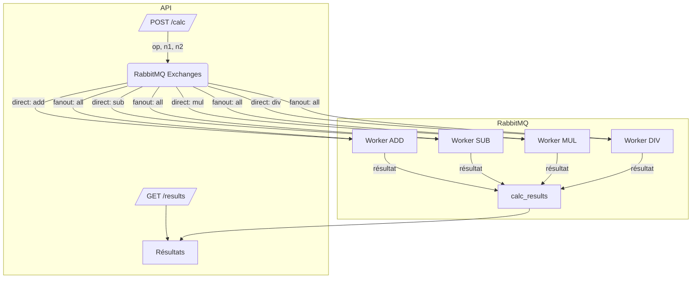

# 📡 Nuclear-physics – (api branch)

Ce projet implémente un système de calcul distribué via une API Node.js (Express) qui utilise RabbitMQ pour distribuer les tâches à différents workers. Deux endpoints sont exposés : `/calc` pour envoyer une requête de calcul, et `/results` pour consulter les derniers résultats reçus.

---

## 🧠 Fonctionnement général

- Les requêtes de calcul (add, sub, mul, div, all) sont envoyées à RabbitMQ via un exchange :
  - `direct` pour les opérations ciblées (`add`, `sub`, `mul`, `div`)
  - `fanout` pour l’opération `all` (envoie à tous les workers)
- Les **workers** consomment les messages, effectuent les calculs, puis envoient les résultats dans la queue `calc_results`.
- Le **consumer Express** lit les résultats de `calc_results` et les met à disposition via l’API `/results`.

---

## 🗺️ Architecture (diagramme Mermaid)



---

## 🔌 API Express

### ➕ POST `/calc`

**Corps JSON :**

```json
{
  "op": "add", // "add", "sub", "mul", "div", "all"
  "n1": 12,
  "n2": 5
}
```

- Envoie une tâche de calcul à RabbitMQ.
- Si `op === "all"` : les 4 workers traiteront la même opération.

**Réponse :**

```json
{
  "status": "Message sent",
  "op": "add",
  "n1": 12,
  "n2": 5
}
```

---

### 📥 GET `/results`

- Retourne les **100 derniers résultats** calculés par les workers.

**Exemple de réponse :**

```json
[
  {
    "n1": 12,
    "n2": 5,
    "op": "add",
    "result": 17
  },
  {
    "n1": 12,
    "n2": 5,
    "op": "sub",
    "result": 7
  },
  {
    "n1": 12,
    "n2": 5,
    "op": "mul",
    "result": 60
  },
  {
    "n1": 12,
    "n2": 5,
    "op": "div",
    "result": 2.4
  }
]
```

---

## 🛠️ Workers disponibles

Les workers traitent chacun un type d'opération. Ils sont lancés avec le paramètre de l’opération en CLI :

```bash
node index.js add  # ou sub, mul, div
```

- `worker_add` ➕ addition
- `worker_sub` ➖ soustraction
- `worker_mul` ✖️ multiplication
- `worker_div` ➗ division (gère la division par zéro)

Chaque worker :
- écoute un queue spécifique à son opération (bindée au `direct exchange`)
- écoute aussi le `fanout exchange` pour les requêtes de type `all`

---

## 📦 Exemple d'utilisation

```bash
# Requête POST vers /calc
curl -X POST http://localhost:3002/calc \
  -H "Content-Type: application/json" \
  -d '{"op": "all", "n1": 12, "n2": 5}'

# Requête GET pour voir les résultats
curl http://localhost:3000/results
```

---

## 🚀 Lancer le projet (avec Docker Compose)

Créer un fichier `.env` à partir de `.env.example`:

```bash
RABBITMQ_URL=amqp://rabbitmq
RABBITMQ_HOST=rabbitmq
RABBITMQ_PORT=5672
RABBITMQ_USER=user
RABBITMQ_PASS=password
NODE_ENV=production
```

Assurez-vous d'avoir Docker et Docker Compose installés.

```bash
docker-compose up --build
```

Vérifiez que l’interface de gestion RabbitMQ est disponible sur :
- http://localhost:15672  
  (user: `user`, pass: `password` par défaut)

